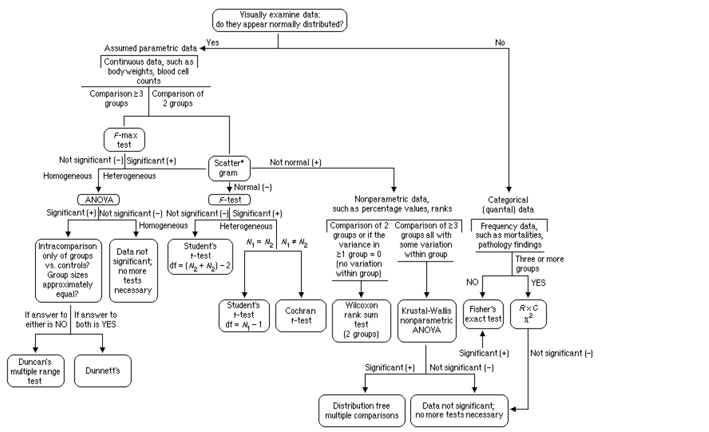
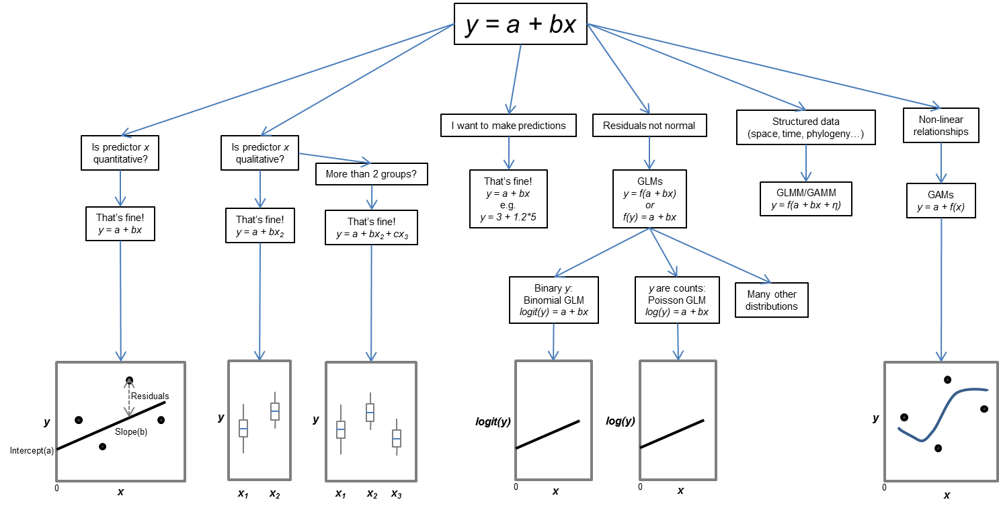

```{r setup, include = FALSE}
options(htmltools.dir.version = FALSE)
library(knitr)
library(tidyverse)
library(xaringanExtra)
library(fontawesome)
library(here)


# set default options
opts_chunk$set(echo=FALSE,
               collapse = TRUE,
               fig.width = 7.252,
               fig.height = 4,
               dpi = 300)
# set engines
knitr::knit_engines$set("markdown")
xaringanExtra::use_tile_view()
xaringanExtra::use_panelset()
xaringanExtra::use_clipboard()
xaringanExtra::use_webcam()
xaringanExtra::use_broadcast()
xaringanExtra::use_share_again()
xaringanExtra::style_share_again(
  share_buttons = c("twitter", "linkedin", "pocket"))

# Change ggplot theme
# - This makes the graphs we will eventually make look pretty. 
# - Don't worry about this for now. 
theme_set(theme_classic() +
            theme(panel.border = element_rect(colour = "black", 
                                              fill = NA),
                  axis.text = element_text(colour = "black"),
                  axis.title.x = element_text(margin = unit(c(2, 0, 0, 0), 
                                                            "mm")),
                  axis.title.y = element_text(margin = unit(c(0, 4, 0, 0), 
                                                            "mm")),
                  legend.position = "none"))
```

class: title-slide, right, top
```{r insert_image_background, include = FALSE}
# Take this code out the chunk and put it in the document to insert images on the slide 
#background-image: url(img/hex-xaringan.png), url(img/frame-art.png)
#background-position: 90% 75%, 75% 75%
#background-size: 8%, cover
```

.right-column[
# `r rmarkdown::metadata$title`
### `r rmarkdown::metadata$subtitle`

### **`r rmarkdown::metadata$author`**<br>
*`r rmarkdown::metadata$institute`* <br>
`r rmarkdown::metadata$date`
]

---
name: about-me
layout: false
class: about-me-slide, inverse, middle, center

# About me


## Guy F. Sutton

### Research Entomologist

.fade[Centre for Biological Control<br>Rhodes University, Makhanda]

---

# What is a statistical model? 

--

- *A model* shows how a variable of interest (Y - response variable) is related to one or more predictor variables (X - explanatory/independent variables).

--

  - E.g. Do larger fruits contain more FCM larvae? 

```{r fig_1, fig.width = 8, fig.height = 4}
# Simulate Gaussian data model for linear relationship
set.seed(2021)             
x <- rnorm(100, 20, 5)          
e <- rnorm(100, 100, 20)    
y <- 0.5 + 2 * x + e  
data <- data.frame(x, e, y)
ggplot(data = data, aes(x = x, y = y)) +
  geom_point() + 
  labs(x = "Fruit diameter (cm)",
       y = "No. of FCM larvae")
```

---

# What is a LINEAR model?

--

- A *linear model* represents how a variable of interest (Y - response variable), or **some distribution of Y** (e.g. log transformed version of Y),  is related to a linear combination of one or more predictor variables (X - explanatory/independent variables). 

--

  - A linear model DOES NOT necessarily expect a straight line between Y and X.

--

  - There just needs to be a straight line between X and some version of Y.

--

```{r fig_exp_transformation, fig.show = "hold", out.width="50%"}
# Set figure parameters
par(mar = c(2, 2, 2, 2),
    mgp = c(3, 1, 0))

# Produce non-linear relationship
xx <- seq(0, 5, length.out = 200)
plot(xx, 
     exp(xx), 
     type = "l",
     xlab = "Fruit diameter (cm)",
     ylab = "No. of FCM larvae",
     main = "(a) Raw data - not linear")

# Log transformatuion - produce linear relationship
plot(xx, 
     log(exp(xx)), 
     type = "l",
     xlab = "Fruit diameter (cm)",
     ylab = "No. of FCM larvae",
     main = "(b) Log transform - linear")
```

--

- As long as we can transform Y to some linear relationship with X, we can model it, without very fancy statistics. 

---

# Why do we use linear models? 

### 1a. Hypothesis testing: Categorical X variable 

- We want to test for a statistical relationship between X and Y.

--

  - E.g. Are there more FCM larvae found in citrus variety A versus B?

--

```{r fig_hyp_test_numeric_x, fig.width = 4, fig.height = 2}
# Reset figure margins 
par(mar=c(5.1, 4.1, 4.1, 2.1), 
    mgp=c(3, 1, 0), 
    las=0)

# Simulate data to compare two groups 
set.seed(2021)             
data <- data.frame(Y = rpois(200, lambda = 5),
                   citrus_var = rep(LETTERS[1:2], each = 100))
ggplot(data = data, aes(x = citrus_var,
                        y = Y,
                        fill = citrus_var)) +
  geom_boxplot() +
  labs(x = "Citrus variety",
       y = "No. of FCM larvae")
```

---

# Why do we use linear models? 

### 1b. Hypothesis testing: Numeric X variable 

- We want to test for a statistical relationship between X and Y.

--

  - E.g. Are there more FCM larvae found in larger fruits?

--

```{r fig_hyp_test_categorical_x, fig.width = 4, fig.height = 2}
# Reset figure margins 
par(mar=c(5.1, 4.1, 4.1, 2.1), 
    mgp=c(3, 1, 0), 
    las=0)

# Simulate data to correlate X and Y
set.seed(2021)             
data <- data.frame(Y = rpois(200, lambda = 5),
                   fruit_diameter = rnorm(200, 20, 5))
ggplot(data = data, aes(x = fruit_diameter,
                        y = Y,
                        fill = fruit_diameter)) +
  geom_point() +
  labs(x = "Fruit diameter (cm)",
       y = "No. of FCM larvae")

```

---

# Why do we use linear models? 

### 1c. Hypothesis testing: Numeric X variable and categorical X variable

- We want to test for a statistical relationship between two X's and Y. 

--

  - E.g. Are there more FCM larvae found in larger fruits, and does this relationship vary among citrus varieties?

--

```{r fig_hyp_test_both_x, fig.width = 8, fig.height = 4, message = FALSE}
# Reset figure margins 
par(mar=c(5.1, 4.1, 4.1, 2.1), 
    mgp=c(3, 1, 0), 
    las=0)

# Simulate data to correlate X and Y amongst groups 
set.seed(2021)             
data <- data.frame(Y = rpois(200, lambda = 5),
                   fruit_diameter = rnorm(200, 20, 5),
                   citrus_var = rep(LETTERS[1:2], each = 100))
ggplot(data = data, aes(x = fruit_diameter,
                        y = Y,
                        colour = citrus_var,
                        fill = citrus_var)) +
  geom_point() +
  geom_smooth(method = "lm") +
  labs(x = "Fruit diameter (cm)",
       y = "No. of FCM larvae",
       fill = "Citrus variety") +
  guides(colour = FALSE,
         fill = guide_legend(override.aes = list(linetype = 0,
                                                 colour = NULL))) +
  theme(legend.position = "right")
```

---

# Why do we use linear models? 

### 2. Prediction 

- We want to predict Y from X

--

  - E.g. On average, how many FCM larave will you find in a fruit of diameter X?

--

  - Remember: *y = mx + c*

--

```{r fig_prediction, fig.width = 4, fig.height = 2, message = FALSE}
# Reset figure margins 
#par(mar=c(5.1, 4.1, 4.1, 2.1), 
#    mgp=c(3, 1, 0), 
#    las=0)

# Simulate data to correlate X and Y
set.seed(2021)             
data <- data.frame(Y = rpois(200, lambda = 5),
                   fruit_diameter = rnorm(200, 20, 5))
mod1 <- lm(Y ~ fruit_diameter, data = data)

ggplot(data = data, aes(x = fruit_diameter,
                        y = Y,
                        fill = fruit_diameter)) +
  geom_point() +
  geom_smooth(method = "lm") +
  labs(x = "Fruit diameter (cm)",
       y = "No. of FCM larvae") +
  annotate("text", 
           x = 6, 
           y = 12, 
           hjust = 0,
           size = 2.2,
           label = "y = 0.07x + 3.37") +
  annotate("text", 
           x = 6, 
           y = 11, 
           hjust = 0,
           size = 2.2,
           label = "If diameter = 20 cm") +
  annotate("text", 
           x = 6, 
           y = 10, 
           hjust = 0,
           size = 2.2,
           label = "y = 0.07(20) + 3.37") +
  annotate("text", 
           x = 6, 
           y = 9, 
           hjust = 0,
           size = 2.2,
           label = "y = 4.77 larvae")
```

---

# Choosing a statistical analysis

```{r fig_old_school_decision_tree, echo = FALSE, fig.cap = " ", out.height="100%", out.width="200%"}

```

--

.center[`r kableExtra::text_spec("This sucks!!!", color = "red")`]

---

# General(ized) Linear Model (GLM) - Your new best friend

```{r fig_new_school_decision_tree, echo = FALSE, fig.cap = " ", out.height="100%", out.width="200%"}

```

.footnote[
[1] Francisco Rodriguez-Sanchez *https://frodriguezsanchez.net*. 
]

---

# General R formula

`mod1 <- glm(response_variable (*y*) ~ 
predictor_variable_1 (x1) + 
predictor variable_2 (x2), 
family = "statistical_family", 
data = dataframe_name)`

--

- `response variable` (*y*): The variable of interest (the thing you are trying to predict)

--

- `predictor_variable_1` (x1): A variable which could explain *y*. Can be numeric or a factor. 

--

- `predictor_variable_2` (x2): As above. We can have many variables (x1, x2... xn).

--

- `statistical family`: the statistical distribution used to model the data (e.g. Gaussian, Poisson, Binomial)

--

- `data_frame_name`: The name of the R variable where your data is stored. 

---

# Quick example

Let's say we have the following data:

- No. of FCM larvae dissected per fruit 
- Fruit diameter (cm)
- Dissected 100 fruits from two different citrus varieties

--

```{r}
# Simulate data to correlate X and Y amongst groups 
set.seed(2021)             
data <- data.frame(no_fcm_larvae = rpois(200, lambda = 5),
                   fruit_diameter = rnorm(200, 20, 5),
                   citrus_var = rep(LETTERS[1:2], each = 100))
dplyr::glimpse(data)
```

--

Research Q: Does the number of FCM larvae per fruit increase with fruit diameter, and are FCM densities higher on citrus variety A versus B? 

--

**Writing this model in R code**

`mod1 <- glm(no_fcm_larvae ~ fruit_diameter + citrus_var, family = gaussian, data = data)`

--

We will go into more detail and example code later.

---

# What types of models can we fit? 

#### Entry-level models (good options for most analyses) (covered in this course)

1. Gaussian GLM - normally distributed Y, real numbers (e.g. FCM body mass)

--

2. Poisson GLM - count data (e.g. no. of FCM larvae)

--

3. Binomial GLM - Binary data (1/0, dead/alive), or proportion (between 0 and 1).

--

#### More advanced models (if options 1-3 are no good, then look here) (not covered in this course)

--

4. Negative binomial GLM - Extension of the Poisson.

--

5. Beta GLM - Extension of the binomial for when *y* is a proportion between 0 and 1, but is never 0 or 1. 

--

6. Gamma GLM - strictly positive numbers. Usually good options for modelling body mass. 

---

# What types of models can we fit? 

## 1. Normal (Gaussian) distribution GLM

- This is equivalent to linear regression if our x predictor variable is numeric (e.g. fruit diameter, nitrogen content, temperature, ect...). 

--

- This is equivalent to an ANOVA if our x predictor is categorical (citrus varieties, sites, ect...)

--

- The response variable (*y*) is continous, real numbers (e.g. 17.1, 6.363) (i.e. they usually can take a decimal place).

--

- The response variable should typically not be an interger/count (e.g. 0, 3, 81), logical (yes/no, dead/alive, 0/1), or a proportion (e.g. bounded between 0 and 1) - there are specific statistical distributions that are more suitable for these data types. 

---

# What types of models can we fit? 

## 1. Normal (Gaussian) distribution

```{r, warning = FALSE, message = FALSE, out.height="80%", out.width="80%"}
set.seed(2021)             
fcm_body_mass <- rnorm(1000, 20, 5) 
citrus_var <- rep(LETTERS[1:2], each = 100)
data <- data.frame(fcm_body_mass, citrus_var) 
data %>% ggplot(data = ., aes(x = fcm_body_mass,
                              fill = citrus_var)) +
  geom_histogram() +
  labs(x = "FCM body mass (mg)",
       y = "Frequency",
       fill = "Citrus variety",
       title = "Example Gaussian response variable") +
  facet_wrap(~ citrus_var, nrow = 2) +
  theme(legend.position = "right")
```

--

**Writing this model in R code**

`mod_gaussian <- glm(fcm_body_mass ~ citrus_var, family = gaussian, data = data)`

---

# What types of models can we fit? 

## 2. Poisson GLM

- The response variable (*y*) is an integer or count(e.g. 0, 8, 81) (i.e. values **CANNOT** take a decimal place).

--

  - If you can say: "number of ... before the name of your variable, a Poisson GLM is likely a good place to start. 
  
--
  
  - E.g. Number of FCM larvae, no. of psyllids per leaf, no. of whiteflies per plant.
  
--
  
  - Usually more smaller values than larger values. 

---

# What types of models can we fit? 

## 2. Poisson GLM

```{r, warning = FALSE, message = FALSE, out.height="80%", out.width="80%"}
set.seed(2021)             
no_flies <- rpois(200, lambda = 2)
citrus_var <- rep(LETTERS[1:2], each = 100)
data <- data.frame(no_flies, citrus_var) 
data %>% ggplot(data = ., aes(x = no_flies,
                              fill = citrus_var)) +
  geom_histogram() +
  labs(x = "No. of flies (per leaf)",
       y = "Frequency",
       fill = "Citrus variety",
       title = "Example Poisson response variable") +
  facet_wrap(~ citrus_var, nrow = 2) +
  theme(legend.position = "right")
```

--

**Writing this model in R code**

`mod_poisson <- glm(no_flies ~ citrus_var, family = poisson, data = data)`

---

# What types of models can we fit? 

## 3. Binomial/logistic GLM

- The response variable (*y*) is a logical/binary variable (e.g. 1/0, dead/alive, yes/no) or a proportion (bounded between 0 and 1). 

--

  - E.g. Proportion insects dead, percentage survival, ect...

---

# What types of models can we fit? 

## 3. Binomial/logistic GLM

```{r, warning = FALSE, message = FALSE, out.height="80%", out.width="80%"}
set.seed(2021)             
fly_survive <- rbinom(200, 1,.5)
pesticide <- rep(LETTERS[1:2], each = 100)
data <- data.frame(fly_survive, pesticide) 
data %>% ggplot(data = ., aes(x = fly_survive,
                              fill = pesticide)) +
  geom_histogram() +
  labs(x = "",
       y = "Proportion flies dead",
       fill = "Pesticide",
       title = "Example binomial/binary response variable") +
  facet_wrap(~ pesticide, nrow = 2) +
  theme(legend.position = "right")
```

--

**Writing this model in R code**

`mod_binomial <- glm(no_flies ~ pesticide, family = binomial, data = data)`

---

# Modelling workflow

- In next session, we will workthrough a basic statistical analysis workflow in R.

```{r fig_tidymodel_workflow, echo = FALSE, fig.cap = " ", out.height="50%", out.width="75%"}
knitr::include_graphics("tidyverse_workflow.png")
```

.footnote[
[1] Wickham and Grolemund (2021) R for Data Science.  *Online textbook: https://r4ds.had.co.nz/*. 
]


